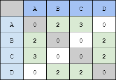
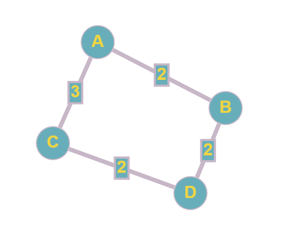

# Graphane

An implementation for my Graph Theory classes.

## Proposal

The idea is to choose and implement four algorithms from a select list.

The chosen algorithm's were:
 - Dijkstra
 - Prim
 - Ford-Fulkerson
 - Kosaraju

## How to use

Each algorithm is isolated on a class that receives a graph on the contructor, and a method with a custom return type. You can use the support class ```GraphBuilder``` to programmatically build your graph, or use the ```CsvGraphReader``` to load a graph from a *adjacency matrix*.

## Loading from CSV

A CSV file using `;` as separator character. For a empty edge value, use the `0` character.

### Header

If you want to give custom names for your nodes, you can use the first line to do so. If the first line contains any non number digit sequence, this sequence will be used as a label for the node on the sequence position.

### Body

Follows a default digraph adjacency matrix, where the values for the first column are related to the node in the position of each row.

#### Graph in CSV format
```
A;B;C;D
0;2;3;0
2;0;0;2
3;0;0;2
0;2;2;0
```

#### Relation representation


#### Result graph
